# pin-stitch ERD

이 문서는 `pin-stitch` MVP의 핵심 데이터 구조를 정의합니다. ERD는 현재 `packages/domain/src/types.ts`의 도메인 타입을 기준으로 작성하며, 실제 DB 구현 시 Prisma schema의 기준 문서로 사용합니다.

## 1. 설계 원칙

- 내부 PK는 화면에 직접 노출하지 않습니다.
- 사용자가 확인해야 하는 주문 식별자는 내부 `orderId`와 별도의 사용자용 `orderNumber`를 둡니다.
- 상품, 주문, 쿠폰, 재고처럼 정합성이 중요한 데이터는 PostgreSQL에 저장합니다.
- 리뷰 요약은 내부적으로 `basisReviewIds`로 근거 리뷰를 추적하지만, 사용자 화면에는 리뷰 수, 체형 조건, 대표 근거 리뷰만 표시합니다.
- 이미지 파일은 DB에 저장하지 않고 AWS S3에 저장하며, DB에는 key, URL, 정렬 순서, 대체 텍스트 등 메타데이터만 저장합니다.
- 라이브 커머스 채팅/이벤트 로그는 P3 확장 범위이며, 초기 ERD에는 포함하지 않습니다.

## 2. 전체 ERD

```mermaid
erDiagram
  USER {
    string user_id PK
    string role
    string name
    string email
    datetime created_at
  }

  BODY_PROFILE {
    string body_profile_id PK
    string user_id FK
    int height_cm
    int weight_kg
    string top_size
    string bottom_size
    string body_shape
    string fit_preference
    boolean consent_to_use_body_data
    datetime updated_at
  }

  PRODUCT {
    string product_id PK
    string brand_id
    string brand_name
    string name
    string description
    string category
    string material
    string fit
    int price_amount
    string price_currency
    string status
    datetime created_at
    datetime updated_at
  }

  PRODUCT_IMAGE {
    string product_image_id PK
    string product_id FK
    string s3_key
    string url
    string alt_text
    int sort_order
    int width
    int height
    datetime created_at
  }

  PRODUCT_VARIANT {
    string variant_id PK
    string product_id FK
    string sku
    string color
    string size
    int available_quantity
  }

  SIZE_MEASUREMENT {
    string size_measurement_id PK
    string product_id FK
    string size
    decimal shoulder_cm
    decimal chest_cm
    decimal waist_cm
    decimal hip_cm
    decimal thigh_cm
    decimal length_cm
    decimal sleeve_cm
  }

  FIT_REVIEW {
    string review_id PK
    string user_id FK
    string product_id FK
    string variant_id FK
    int rating
    string content
    int height_cm
    string body_shape
    string fit_preference
    string purchased_size
    string fit_result
    datetime created_at
  }

  REVIEW_KEYWORD {
    string review_keyword_id PK
    string review_id FK
    string sentiment
    string keyword
  }

  REVIEW_IMAGE {
    string review_image_id PK
    string review_id FK
    string s3_key
    string url
    string alt_text
    int sort_order
    int width
    int height
    datetime created_at
  }

  REVIEW_SUMMARY {
    string review_summary_id PK
    string product_id FK
    string variant_id FK
    string body_profile_id FK
    string summary
    int matched_review_count
    datetime generated_at
  }

  REVIEW_SUMMARY_BASIS {
    string review_summary_id FK
    string review_id FK
  }

  REVIEW_SUMMARY_WARNING {
    string review_summary_warning_id PK
    string review_summary_id FK
    string warning
    int sort_order
  }

  STORE {
    string store_id PK
    string name
    string address
    decimal lat
    decimal lng
    boolean is_open
  }

  STORE_INVENTORY {
    string store_inventory_id PK
    string store_id FK
    string product_id FK
    string variant_id FK
    int quantity
    string floor
    string zone
    string rack
    datetime updated_at
  }

  COUPON {
    string coupon_id PK
    string user_id FK
    string name
    string discount_type
    decimal discount_value
    int max_discount_amount
    int min_order_amount
    string target_type
    boolean stackable
    datetime starts_at
    datetime ends_at
  }

  COUPON_TARGET {
    string coupon_target_id PK
    string coupon_id FK
    string target_id
  }

  CART {
    string cart_id PK
    string user_id FK
    int subtotal_amount
    int discount_total_amount
    int final_total_amount
    string currency
    datetime updated_at
  }

  CART_ITEM {
    string cart_item_id PK
    string cart_id FK
    string product_id FK
    string variant_id FK
    int quantity
    int unit_price_amount
    string unit_price_currency
    int line_total_amount
    string line_total_currency
  }

  CART_COUPON_APPLICATION {
    string cart_coupon_application_id PK
    string cart_id FK
    string coupon_id FK
    string cart_item_id FK
    int discount_amount
    string discount_currency
    string reason
  }

  CART_EXCLUDED_COUPON {
    string cart_excluded_coupon_id PK
    string cart_id FK
    string coupon_id FK
    string reason_code
    string message
  }

  ORDER {
    string order_id PK
    string order_number
    string user_id FK
    string status
    string recipient_name
    string phone
    string postal_code
    string address1
    string address2
    int subtotal_amount
    int discount_total_amount
    int final_total_amount
    string currency
    datetime created_at
    datetime updated_at
  }

  PAYMENT {
    string payment_id PK
    string order_id FK
    string order_number
    string provider
    string status
    int amount
    string currency
    string provider_order_id
    string provider_payment_key
    string method
    string receipt_url
    datetime requested_at
    datetime approved_at
    datetime failed_at
    string failure_code
    string failure_message
    datetime canceled_at
    string cancel_reason
    datetime created_at
    datetime updated_at
  }

  SHIPMENT {
    string shipment_id PK
    string order_id FK
    string order_number
    string status
    string carrier_name
    string tracking_number
    string tracking_url
    date estimated_delivery_date
    datetime shipped_at
    datetime delivered_at
    datetime delayed_at
    string delay_reason
    datetime last_checked_at
    datetime created_at
    datetime updated_at
  }

  ORDER_LINE {
    string order_line_id PK
    string order_id FK
    string product_id FK
    string variant_id FK
    int quantity
    int unit_price_amount
    int line_total_amount
    string currency
  }

  ORDER_COUPON_APPLICATION {
    string order_coupon_application_id PK
    string order_id FK
    string coupon_id FK
    string order_line_id FK
    int discount_amount
    string discount_currency
    string reason
  }

  RETURN_REASON {
    string return_reason_id PK
    string order_id FK
    string product_id FK
    string variant_id FK
    string user_id FK
    string reason_code
    string memo
    datetime created_at
  }

  SELLER_INSIGHT {
    string insight_id PK
    string product_id FK
    string type
    string severity
    string message
    datetime created_at
  }

  ANALYTICS_EVENT {
    string analytics_event_id PK
    string user_id FK
    string session_id
    string event_name
    string product_id FK
    string order_id FK
    json metadata
    datetime created_at
  }

  USER ||--o| BODY_PROFILE : "has"
  USER ||--o{ FIT_REVIEW : "writes"
  USER ||--o{ COUPON : "owns"
  USER ||--o{ CART : "has"
  USER ||--o{ ORDER : "places"
  USER ||--o{ RETURN_REASON : "creates"
  USER ||--o{ ANALYTICS_EVENT : "emits"

  PRODUCT ||--o{ PRODUCT_IMAGE : "has"
  PRODUCT ||--o{ PRODUCT_VARIANT : "has"
  PRODUCT ||--o{ SIZE_MEASUREMENT : "has"
  PRODUCT ||--o{ FIT_REVIEW : "receives"
  PRODUCT ||--o{ REVIEW_SUMMARY : "summarized_by"
  PRODUCT ||--o{ STORE_INVENTORY : "stocked_as"
  PRODUCT ||--o{ CART_ITEM : "added_as"
  PRODUCT ||--o{ ORDER_LINE : "ordered_as"
  PRODUCT ||--o{ RETURN_REASON : "returned_for"
  PRODUCT ||--o{ SELLER_INSIGHT : "has"
  PRODUCT ||--o{ ANALYTICS_EVENT : "tracked_by"

  PRODUCT_VARIANT ||--o{ FIT_REVIEW : "reviewed_as"
  PRODUCT_VARIANT ||--o{ STORE_INVENTORY : "stocked_as"
  PRODUCT_VARIANT ||--o{ CART_ITEM : "selected_as"
  PRODUCT_VARIANT ||--o{ ORDER_LINE : "ordered_as"
  PRODUCT_VARIANT ||--o{ RETURN_REASON : "returned_as"

  FIT_REVIEW ||--o{ REVIEW_KEYWORD : "has"
  FIT_REVIEW ||--o{ REVIEW_IMAGE : "has"
  FIT_REVIEW ||--o{ REVIEW_SUMMARY_BASIS : "supports"

  REVIEW_SUMMARY ||--o{ REVIEW_SUMMARY_BASIS : "uses"
  REVIEW_SUMMARY ||--o{ REVIEW_SUMMARY_WARNING : "has"
  BODY_PROFILE ||--o{ REVIEW_SUMMARY : "basis_for"

  STORE ||--o{ STORE_INVENTORY : "has"

  COUPON ||--o{ COUPON_TARGET : "targets"
  COUPON ||--o{ CART_COUPON_APPLICATION : "applied_to"
  COUPON ||--o{ CART_EXCLUDED_COUPON : "excluded_from"
  COUPON ||--o{ ORDER_COUPON_APPLICATION : "snapshotted_to"

  CART ||--o{ CART_ITEM : "contains"
  CART ||--o{ CART_COUPON_APPLICATION : "applies"
  CART ||--o{ CART_EXCLUDED_COUPON : "excludes"
  CART_ITEM ||--o{ CART_COUPON_APPLICATION : "discounted_by"

  ORDER ||--o{ ORDER_LINE : "contains"
  ORDER ||--o{ ORDER_COUPON_APPLICATION : "applies"
  ORDER ||--o{ PAYMENT : "paid_by"
  ORDER ||--o{ SHIPMENT : "ships_as"
  ORDER ||--o{ RETURN_REASON : "may_have"
  ORDER ||--o{ ANALYTICS_EVENT : "tracked_by"
  ORDER_LINE ||--o{ ORDER_COUPON_APPLICATION : "discounted_by"
```



## 3. 주요 엔티티 설명

| 엔티티 | 역할 |
| --- | --- |
| `USER` | 고객, 셀러, 관리자 계정의 공통 사용자 |
| `BODY_PROFILE` | 체형 적합도와 리뷰 필터링에 사용하는 사용자 체형 정보 |
| `PRODUCT` | 상품 기본 정보 |
| `PRODUCT_VARIANT` | 상품 색상/사이즈 옵션 |
| `SIZE_MEASUREMENT` | 상품별 사이즈 실측표 |
| `FIT_REVIEW` | 체형 정보가 포함된 구매 리뷰 |
| `REVIEW_KEYWORD` | 리뷰의 긍정/부정 키워드 |
| `REVIEW_SUMMARY` | 체형 기반 리뷰 요약 결과 |
| `REVIEW_SUMMARY_BASIS` | 요약에 사용된 근거 리뷰 연결 테이블 |
| `STORE`, `STORE_INVENTORY` | 오프라인 매장과 옵션별 재고 |
| `COUPON`, `COUPON_TARGET` | 쿠폰 정책과 적용 대상 |
| `CART`, `CART_ITEM` | 장바구니와 장바구니 상품 |
| `CART_COUPON_APPLICATION` | 장바구니에 자동 적용된 쿠폰 결과 |
| `CART_EXCLUDED_COUPON` | 조건 미충족으로 제외된 쿠폰과 사유 |
| `ORDER`, `ORDER_LINE` | 주문과 주문 상품 스냅샷 |
| `ORDER_COUPON_APPLICATION` | 주문 생성 시점의 쿠폰 적용 스냅샷 |
| `PAYMENT` | 토스페이먼츠 결제 승인, 실패, 취소 기록 |
| `SHIPMENT` | 배송 상태, 운송장, 지연 사유, MCP 배송 모니터링 기준 데이터 |
| `RETURN_REASON` | 반품 사유 데이터 |
| `SELLER_INSIGHT` | 셀러 상품 개선 인사이트 |
| `ANALYTICS_EVENT` | 커머스 지표와 퍼널 분석을 위한 이벤트 로그 |

## 4. 설계 메모

### DB 테이블로 두지 않는 타입

아래 타입은 `packages/domain/src/types.ts`에는 존재하지만, MVP ERD에서는 별도 테이블로 두지 않습니다.

| 타입 | 처리 방식 |
| --- | --- |
| `FitScore` | 상품, 리뷰, 반품 데이터를 기반으로 계산합니다. 필요하면 캐시 테이블을 나중에 추가합니다. |
| `ProductListResponse`, `ProductDetailResponse` | 사용자 API 응답 DTO입니다. `PRODUCT`, `PRODUCT_IMAGE`, `PRODUCT_VARIANT`, `SIZE_MEASUREMENT`를 조합해 만들며 DB 저장 대상이 아닙니다. |
| `ReviewListResponse` | 사용자 리뷰 목록 API 응답 DTO입니다. `FIT_REVIEW`를 기반으로 만들지만 `review_id`, `user_id` 같은 내부 식별자는 포함하지 않습니다. |
| `ReviewSummaryResponse` | 사용자 API 응답 DTO입니다. `REVIEW_SUMMARY`, `REVIEW_SUMMARY_BASIS`, `FIT_REVIEW`를 조합해 만들며 DB 저장 대상이 아닙니다. |
| `SellerProductInsight` | `FIT_REVIEW`, `REVIEW_KEYWORD`, `RETURN_REASON`, `SELLER_INSIGHT`를 집계해 응답합니다. |
| `FitKeywordStat` | `REVIEW_KEYWORD` 집계 결과입니다. |
| `BodyShapeSatisfaction` | 리뷰와 반품 데이터를 체형별로 집계한 결과입니다. |
| `SizeFitDistribution` | 리뷰의 `purchased_size`, `fit_result` 집계 결과입니다. |
| `CartPricing` | `CART`, `CART_ITEM`, 쿠폰 적용 결과를 기반으로 계산하고, 필요한 금액 스냅샷은 `CART`에 저장합니다. |
| `Pagination` | API 응답 메타 성격의 값입니다. |
| `ApiResponse`, `ApiMeta`, `ApiError` | API 응답 포맷이며 DB 저장 대상이 아닙니다. |

`REVIEW_SUMMARY`는 규칙 기반 요약 결과를 재사용하거나 검수하기 위해 저장할 수 있는 캐시성 테이블입니다. `variant_id`, `body_profile_id`는 요약 기준에 따라 nullable로 둘 수 있습니다.

### Money 처리

`Money` 타입은 DB에서 금액과 통화를 분리해 저장합니다.

```text
amount: integer
currency: string
```

MVP의 기본 통화는 `KRW`입니다.

적용 대상:

- `PRODUCT.price`
- `CART_ITEM.unitPrice`
- `CART_ITEM.lineTotal`
- `CART.pricing.subtotal`
- `CART.pricing.discountTotal`
- `CART.pricing.finalTotal`
- `ORDER_LINE.unitPrice`
- `ORDER_LINE.lineTotal`
- `ORDER.pricing.subtotal`
- `ORDER.pricing.discountTotal`
- `ORDER.pricing.finalTotal`
- `CouponApplication.discountAmount`

### 상품 이미지

`Product.images`는 DB의 `PRODUCT_IMAGE` 레코드를 `sort_order` 오름차순으로 변환한 배열입니다.

API 응답에서는 다음 필드를 기본으로 제공합니다.

```text
url: string
altText: string
sortOrder: integer
```

`altText`는 상품 카드와 상품 상세 이미지의 대체 텍스트로 사용합니다.

### 리뷰 키워드

`FIT_REVIEW.fit_preference`는 리뷰 작성 시점의 선호 핏 스냅샷입니다. 사용자가 이후 체형 프로필의 선호 핏을 변경해도 과거 리뷰의 기대 핏 해석이 바뀌지 않도록 리뷰에 저장합니다.

`FitReview` 타입의 `positiveKeywords`, `negativeKeywords` 배열은 DB에서는 `REVIEW_KEYWORD` 테이블로 분리합니다.

```text
sentiment: POSITIVE | NEGATIVE
keyword: string
```

이 구조는 셀러 키워드 분석과 리뷰 필터링에 재사용할 수 있습니다.

### 리뷰 요약 근거

`ReviewSummary.basisReviewIds`는 DB에서 `REVIEW_SUMMARY_BASIS` 연결 테이블로 관리합니다.

사용자 API와 화면에는 리뷰 ID를 노출하지 않고 `ReviewSummaryResponse` 형태로 다음 정보만 제공합니다.

- 요약에 사용된 리뷰 수
- 체형 조건
- 대표 근거 리뷰

### 쿠폰 적용

쿠폰 적용 결과는 장바구니와 주문에 각각 저장합니다.

- `CART_COUPON_APPLICATION`: 현재 장바구니 기준 자동 적용 결과
- `ORDER_COUPON_APPLICATION`: 주문 생성 시점의 할인 스냅샷

주문 생성 이후 쿠폰 정책이나 상품 가격이 바뀌어도 주문 당시 할인 내역은 유지되어야 합니다.

`COUPON_TARGET.target_id`는 `COUPON.target_type`에 따라 의미가 달라집니다.

| `target_type` | `target_id` 의미 |
| --- | --- |
| `ORDER` | 비워두거나 `ORDER` 같은 고정 값을 사용 |
| `PRODUCT` | `product_id` |
| `CATEGORY` | `ProductCategory` 값 |
| `BRAND` | `brand_id` |

### 주문번호

`ORDER.order_id`는 내부 식별자입니다. 사용자 화면, 주문 상세 URL, 고객센터 문의에는 `ORDER.order_number`를 표시합니다.

`order_number` 분리는 보안 경계가 아니라 사용자 경험과 내부 식별자 보호를 위한 설계입니다. 권한 검사는 반드시 현재 사용자와 주문 소유자를 함께 확인해야 합니다.

예시:

```text
내부 ID: ord_abc123
사용자 표시 주문번호: 20260519-0001
```

실제 PostgreSQL 테이블명은 SQL 예약어 충돌을 피하기 위해 `orders`처럼 복수형 또는 `customer_orders` 같은 이름을 사용합니다. ERD의 `ORDER`는 도메인 타입 `Order`와의 대응을 쉽게 보기 위한 표기입니다.

### 결제

`PAYMENT`는 토스페이먼츠 테스트 결제를 포함한 외부 PG 결제 기록입니다.

핵심 필드:

| 필드 | 의미 |
| --- | --- |
| `payment_id` | 내부 결제 식별자 |
| `order_id` | 내부 주문 FK |
| `order_number` | 사용자용 주문번호 스냅샷 |
| `provider` | `TOSS_PAYMENTS` |
| `status` | `READY`, `IN_PROGRESS`, `APPROVED`, `FAILED`, `CANCELED` |
| `amount`, `currency` | 주문 스냅샷 기준 결제 금액 |
| `provider_order_id` | 토스페이먼츠에 전달한 주문 ID. MVP에서는 `order_number`와 동일하게 사용 |
| `provider_payment_key` | 토스페이먼츠가 발급한 결제 키. 승인/조회/취소에 사용 |
| `method` | 카드, 계좌이체 등 토스 응답의 결제수단 |
| `receipt_url` | 영수증 URL |
| `failure_code`, `failure_message` | 승인 실패 원인 |
| `cancel_reason` | 취소 사유 |

결제 상태와 주문 상태는 함께 갱신합니다.

| 결제 흐름 | `Payment.status` | `Order.status` |
| --- | --- | --- |
| 주문 생성 직후 | `READY` | `PAYMENT_PENDING` |
| 토스 결제창 진행 중 | `IN_PROGRESS` | `PAYMENT_PENDING` |
| 승인 성공 | `APPROVED` | `PAID` |
| 승인 실패 확정 | `FAILED` | `PAYMENT_FAILED` |
| 결제 취소 | `CANCELED` | `CANCELLED` |

서버는 토스 승인 요청 전에 반드시 `provider_order_id`와 `ORDER.order_number`, 승인 요청 `amount`와 `ORDER.final_total_amount`를 비교합니다.

### 배송

`SHIPMENT`는 주문 이후 배송 상태와 운송장 정보를 저장하는 테이블입니다. MVP에서는 외부 택배사 실시간 연동 없이 셀러/관리자 또는 시드 데이터가 상태를 갱신합니다. 이후 MCP 서버는 이 테이블을 조회해 지연 배송을 감지하고 보상 쿠폰 발급 같은 자동화를 수행합니다.

배송 상태:

| 상태 | 의미 |
| --- | --- |
| `PREPARING` | 배송 준비 중 |
| `IN_TRANSIT` | 배송 중 |
| `DELIVERED` | 배송 완료 |
| `DELAYED` | 배송 지연 |
| `DELIVERY_FAILED` | 배송 실패 |

핵심 설계:

- 결제 승인 성공 후 기본 `SHIPMENT.status`는 `PREPARING`입니다.
- `tracking_number`, `tracking_url`은 운송장이 발급된 이후 채웁니다.
- `DELAYED` 상태는 MCP 지연 감지와 고객 선제 안내의 핵심 트리거입니다.
- `delay_reason`에는 `브랜드 출고 지연`, `물류센터 지연`, `택배사 집화 지연`처럼 고객에게 설명 가능한 사유를 저장합니다.
- 고객 화면에는 `shipment_id`, 내부 `order_id`를 노출하지 않습니다.
- 외부 택배사 API 연동은 P2로 미루되, `last_checked_at`을 둬 향후 가상 택배 API나 실제 택배 API polling 결과를 저장할 수 있게 합니다.

### 재고

`PRODUCT_VARIANT.available_quantity`는 온라인 옵션 재고를 나타냅니다. `STORE_INVENTORY.quantity`는 오프라인 매장별 재고를 나타냅니다.

사용자 화면에서는 정책에 따라 정확한 수량 대신 다음처럼 가공해 표시할 수 있습니다.

- 재고 있음
- 소량 남음
- 품절

### Analytics Event

`ANALYTICS_EVENT`는 실제 사용자 데이터가 부족한 MVP에서 시드 이벤트와 앱 내 이벤트 수집을 함께 다루기 위한 테이블입니다.

초기 이벤트 예시:

- `product_list_viewed`
- `product_detail_viewed`
- `fit_score_viewed`
- `review_summary_clicked`
- `review_filter_used`
- `store_inventory_clicked`
- `add_to_cart`
- `checkout_started`
- `order_created`
- `cart_abandoned`
